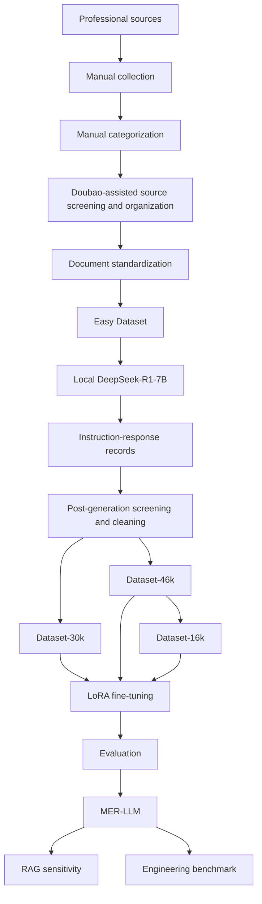

# MER-LLM

Reproducibility package for:

**MER-LLM: an efficient, lightweight large language model for marine ecosystem restoration domain knowledge support**

## Overview

This repository collects the public, reproducibility-relevant materials for the MER-LLM revision workflow. It is designed to answer reviewer concerns about code availability, dataset access, LoRA configuration, random seeds, evaluation transparency, RAG comparison, engineering benchmarking, and data/code availability.

## Repository Scope

Public in this repository:

- Dataset-16k record-level data, train split, and validation split
- preprocessing scripts and public examples
- training configuration, LoRA adapter metadata, and sanitized logs
- objective paired statistics and McNemar analysis
- targeted base-evaluation correction evidence for Qwen1.5-4B-Chat / Dataset-16k / 2 epochs
- configuration-level expert scoring summaries and ICC evidence
- RAG workflow configuration and sensitivity outputs
- engineering benchmark configuration and outputs
- reproducibility notes, limitations, file provenance, and checksums

Not publicly redistributed:

- Dataset-30k record-level contents
- Dataset-46k record-level contents
- raw copyrighted source documents, standards, books, papers, and converted full-text corpora
- model weights, optimizer states, checkpoint directories, credentials, or private account material

## Workflow

## Public Dataset

Dataset-16k is the complete public data example:

- full cleaned set: 16,631 records
- historical train split: 14,967 records
- historical validation split: 1,664 records
- schema: Alpaca-style `instruction`, `input`, `output`, `system` where present

## Restricted Datasets

Dataset-30k and Dataset-46k are documented in `data/private_dataset_metadata/`, but the record-level contents are not redistributed due to project data-release restrictions.

## LoRA Configuration

MER-LLM uses Qwen2.5-1.5B-Instruct with LoRA:

- rank: 8
- alpha: 16
- dropout: 0.1
- target modules: `q_proj`, `k_proj`, `v_proj`, `o_proj`, `gate_proj`, `up_proj`, `down_proj`
- trainable parameters: 9,232,384 / 1,552,946,688 (0.5945%)
- cutoff length: 2048
- optimizer: `adamw_torch`
- scheduler: cosine
- warmup steps: 300
- per-device train batch size: 4
- gradient accumulation: 8
- effective batch size: 32
- precision: BF16
- quantization: none
- training seed: 42
- learning rate: `4.0e-05`

## Random Seeds

The training framework records `seed = 42`. The actual historical Dataset-16k train/validation files are included.

## Expected Results

Objective paired analysis:

- Base: 820/1100
- MER: 865/1100
- both correct: 739
- Base wrong -> MER correct: 126
- Base correct -> MER wrong: 81
- both wrong: 154
- discordant total: 207
- continuity-corrected McNemar chi-square: approximately 9.352657
- exact two-sided p-value: approximately 0.00215019

RAG sensitivity:

- top-3: 858/1100 = 78.00%
- top-5: 875/1100 = 79.55%
- MER: 865/1100 = 78.6364%

Engineering benchmark for final MER-LLM on RTX 4090D:

- peak GPU memory: about 3.84 GB
- median end-to-end latency: about 4.91 s/query
- throughput: about 19.72 tokens/s

## Reproduction Scope

Fully reproducible from public repository:

- Dataset-16k schema/count validation
- Dataset-16k small smoke-test loading
- LoRA configuration inspection
- paired objective McNemar calculation from the included paired matrix
- RAG sensitivity result inspection
- engineering benchmark result inspection

Partially reproducible:

- full final training workflow, because base model downloads and compute environment are external
- professional question-bank evaluation, pending author/public-release confirmation of question-bank redistribution

Configuration reproducible but data restricted:

- Dataset-30k experiments
- Dataset-46k experiments

## Citation

See `CITATION.cff`.

## License

See `LICENSE_RECOMMENDATION.md` and `DATA_LICENSE_NOTE.md`. Final license selection requires author confirmation.
